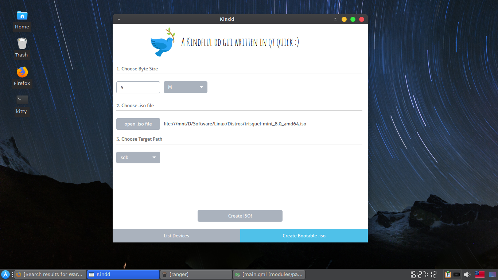
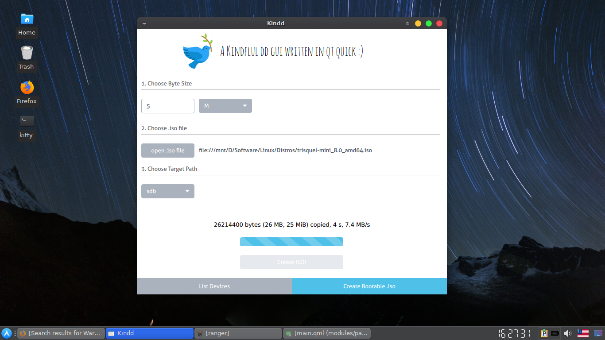
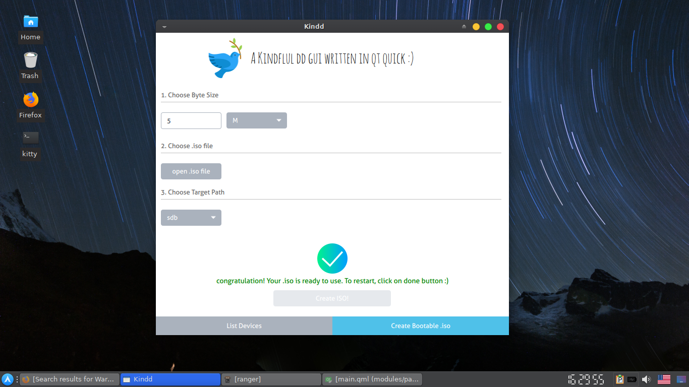

# Kindd   
A kindly dd gui written in qt quick :)

## Preview

## Purposes
1. Provide a modern/simple/safe UI for dd command.
2. You can create bootable device with kindd.

##
|Warning|Process|Done|
|:-----:|:-----:|:-----:|
||||
|Click image to enlarge|Click image to enlarge| Click image to enlarge|

## Installation

### Arch
1. if you have arch-linux, life is easy:). just go to AUR:

    `packer -S kindd-git`

### Build From Source
2. Install these dependencies first:

|Dependencies||
|-----|:-----:|
|[git](https://www.archlinux.org/packages/extra/x86_64/git/)|
|[coreutils](https://www.archlinux.org/packages/core/x86_64/coreutils/)|
|[polkit](https://www.archlinux.org/packages/extra/x86_64/polkit/)|
|[qt5-base](https://www.archlinux.org/packages/extra/x86_64/qt5-base/)|
|[qt5-quickcontrols](https://www.archlinux.org/packages/extra/x86_64/qt5-quickcontrols/)|
|[qt5-quickcontrols2](https://www.archlinux.org/packages/extra/x86_64/qt5-quickcontrols2/)|
|[qt5-graphicaleffects](https://www.archlinux.org/packages/extra/x86_64/qt5-graphicaleffects/)

3. clone the repo:

    `git clone https://github.com/LinArcX/Kindd/`

4. go to cloned directory and make the project with qmake build tools:

    `cd Kindd`

    `qmake`

    `make`

5. run the application:

    `./kindd`

## Contributing
 
1. Fork it!
2. Create your feature branch: `git checkout -b my-new-feature`
3. Commit your changes: `git commit -am 'Add some feature'`
4. Push to the branch: `git push origin my-new-feature`
5. Submit a pull request :D

## Bugs
 

Bugs should be reported [here](https://github.com/LinArcX/Kindd/issues) on the Github issues page.

## Credits
LinArcX
Github Repo:[https://github.com/LinArcX](https://github.com/LinArcX)

E-Mail:linarcx@gmail.com

<h1 align="center">
	
	 
	 
	
kindly + dd

</h1>

## License

